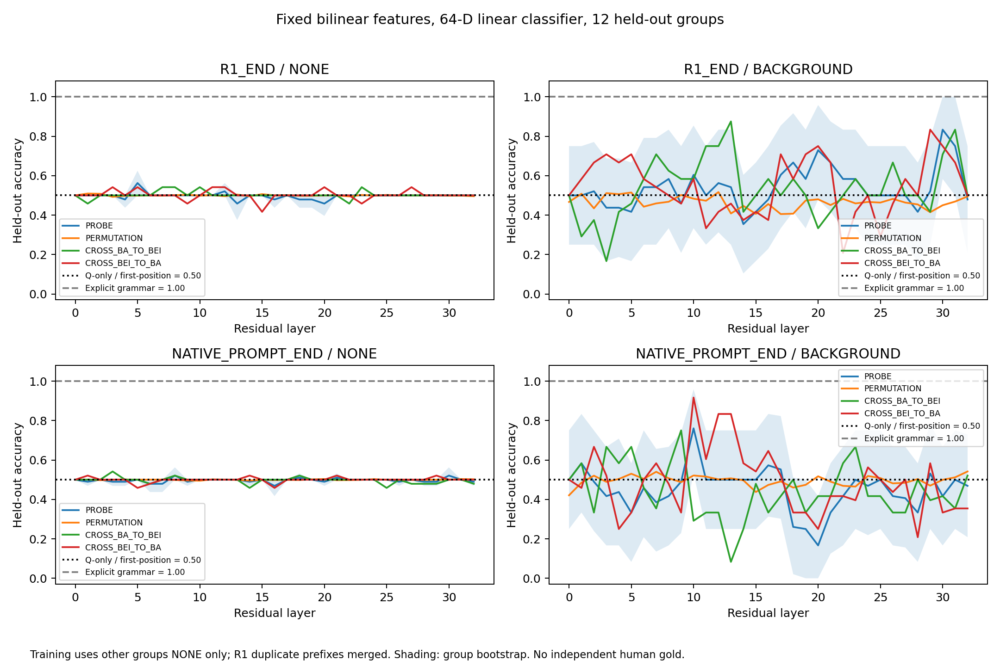
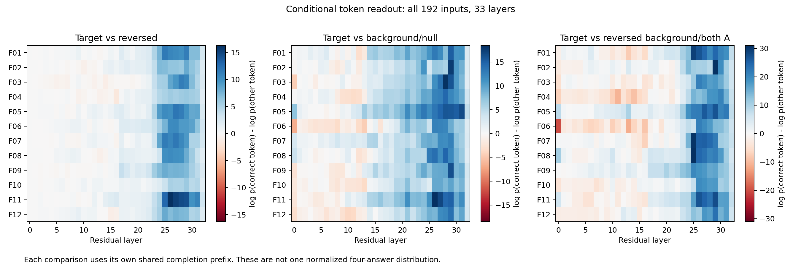
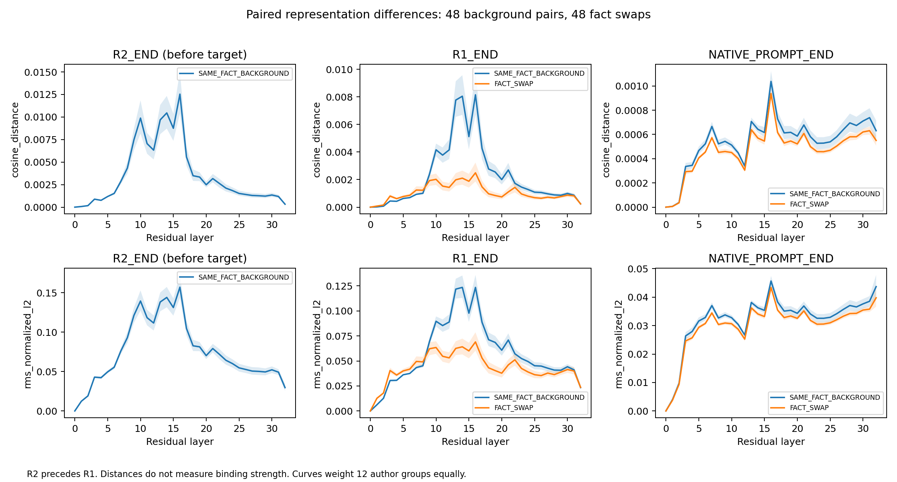
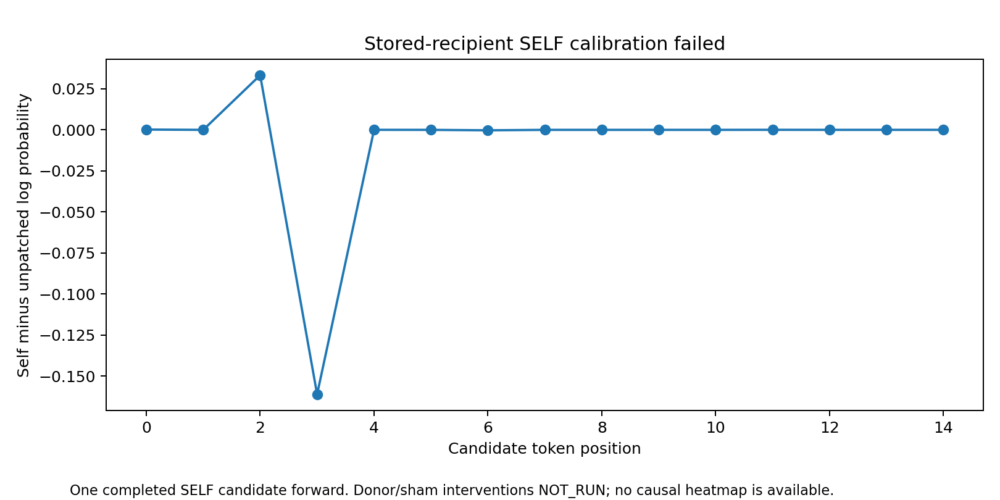
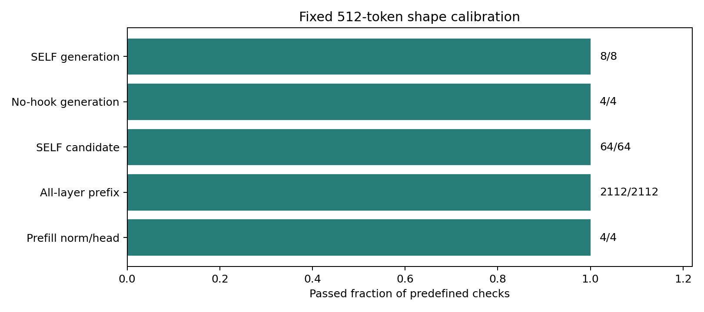

# Role-binding observations and the fixed-shape repair

**Two separate outcomes:** the original observational probe does not yet establish a transferable role decoder; the separately authorized fixed-shape repair passes its frozen tool-calibration checks. No donor/sham causal experiment has been run.

## Actual coverage

| Component | Completed evidence | Interpretation |
|---|---:|---|
| Original prompt states | 192 prompts, 33 layers, four anchors where available | Existing B61 JSON materials, one Apertus snapshot |
| Natural generations | 48 baselines + 4 no-hook controls | Baselines: 30 correct, 18 target-role reversals; all 48 match their B61 parent outputs token for token |
| Candidate scores | 768 baselines + 1 failed SELF candidate | Complete-answer teacher-forced scores; separate from natural outputs |
| Layer readouts | 19,008 teacher-forced + 1,584 native-prefix records | 20,592 single-position full-vocabulary projections, not model generations |
| Probe computation | 18,228 fits / 278,976 predictions | Includes permutations and construction-transfer controls; not independent input examples |
| Original intervention generations | 0 | Not run because SELF score calibration failed; no rescue/harm estimate exists |
| Fixed-shape calibration | All 108 work items; 446 model forwards | Separate eight-case tool repair, not a new role-repair method |

The original AUX used 2,225 forwards and 595,785 input-token positions. The repair used 446 forwards, 228,352 positions and 1,360 candidate-scored tokens, finishing within its frozen limits. Do not add fit counts or layer readouts to the behavioral sample size.

## What the probe and lens show

The x-axis is the residual layer (0 is embedding output; 1–32 are transformer-block outputs). The y-axis is held-out classification accuracy for whether participant A is the actor. At each fold, the classifier sees NONE examples from the other 11 author groups. The blue curve uses a fixed 64-dimensional **name-conditioned bilinear feature** followed by a linear classifier; it is not a direct linear decoder of the hidden state alone. Orange is the training-label-permutation control; green/red train on one construction and test on the other. The fixed explicit BA/BEI rule is a task control, not a model probe. Shading is author-group bootstrap uncertainty.

NONE performance stays near chance across layers: the main probe spans 45.83–56.25% at R1 end and 46.88–52.08% at native prompt end. These ranges are descriptive, **not selected best-layer confirmation**. Background curves vary more, but background labels are constant within each group (odd groups A-actor, even groups B-actor), despite being 48/48 globally balanced. NONE includes within-group original/role-swap contrasts. This limits what a high background-only score can demonstrate.

The statement in an intermediate summary that all background labels were positive was an editorial error. Main and executor checked the actual references and all prediction labels, corrected the prose, and kept [the correction record](LABEL-EDITORIAL-CORRECTION.json); no raw labels, predictions or model outputs were changed.

Here the y-axis lists the 12 author groups, the x-axis lists layers, and color gives the group-mean **log-probability difference between the correct and competing token at their first divergence**. C1 reverses target roles; C2 uses background roles (or null/null under NONE); C3 reverses the background roles (or both A under NONE). Each candidate pair uses its own shared completion prefix. Late preference for an author-consistent token is a conditional readout, not a normalized distribution over four full answers and not evidence that an incorrect natural answer follows a previously settled correct belief. All full prefixes, top-10 vocabulary entries, token ranks and log probabilities are retained in the readouts.

These compare same-fact background edits with real target-role swaps. R2 end occurs **before the target**, so it cannot be interpreted as a settled target-role representation. Distance is a representation-change measure, not binding strength. Main recomputed all 11,088 saved-state distance rows.

## Why the original interventions stopped

The first run stopped on a cross-length causal-prefix comparison. Same-length comparisons were exact; a read-only causal-mask inspection did not find future-token access. That pattern suggested a length-associated implementation/numerical issue, without proving its exact kernel origin. A bounded continuation completed the observational analysis, with unchanged original records and strict SELF criteria.

Its first actual disk-archived SELF candidate then failed: `SAME-F01-D0-L04-R2_END-SELF`, candidate `AUX-RB-010-C0`. The stored state and the current candidate-pass state differed (maximum absolute difference 1.0; relative L2 0.0222768). Reinjection changed total candidate log probability from −1.24043571 to −1.36825319 (delta −0.12781748), with maximum single-token delta 0.16109395.

Consequently the original donor/sham and intervention free-generation steps were **NOT_RUN**. There is no causal intervention heatmap to interpret. Ordinary no-hook controls had passed, but that was insufficient to validate archived-state reinjection across different computation lengths.

## What the repair actually fixed

The separate **AUX-CAL-02** used eight predetermined inputs from four original groups. Every model forward had shape `[1,512]`: original valid tokens at the left, masked padding on the right, unchanged snapshot/precision, eager attention, no KV cache. The next token was read from the last valid position, not the pad position. Stored states were genuinely saved to disk and reloaded.

- Four full-shape norm/head reconstructions: maximum difference 0, argmax identical.
- All 2,112 candidate-prefix layer/anchor comparisons: exactly equal.
- All 64 SELF candidates: actual scored logit rows and token log probabilities exactly equal to their baseline. Main independently compared the saved tensors on CPU and matched their hashes to local files.
- Four no-hook and eight SELF generations: exact token identity with their fixed-shape baselines; all 208 pre-injection state comparisons equal.
- Eight old versus new baselines: all token-identical, **still 3 correct and 5 reversed**.

This is a successful calibration repair for these eight cases and the frozen configuration. It does not prove robustness in arbitrary contexts, fix the original role errors, identify a causal mechanism, or validate the weak probe. Subsequent donor interventions require a new scientific decision and design.

## Files for independent checking

- [192 actual inputs](inputs.json), [candidate definitions](CANDIDATES.json), [held-out folds](PROBE-FOLDS.json), [48 baseline answers](BASELINE-RESULTS.json), [all 52 generations](GENERATIONS.jsonl), [candidate/SELF scores](CANDIDATE-SCORES.jsonl).
- [Probe curves and uncertainty as CSV](figures/02_probe_holdout.csv), [complete 278,976 prediction records, gzip](PROBE-PREDICTIONS.jsonl.gz), [full layer readouts, gzip](LENS.jsonl.gz). These compressed files are downloadable data; uncompress them before JSONL inspection. [Analysis code](analyze_observations.py) uses locally archived hidden arrays; those arrays are committed by hash, not included as public model tensors.
- [Lens figure data](figures/01_candidate_lens.csv), [distance data](figures/03_distances.csv), [SELF differences](figures/04_self_calibration_failure.csv), [figure code](make_figures.py). Every PNG also has a same-stem vector PDF.
- CAL02 [actual inputs](CAL02/EXECUTION-INPUTS.json), [108 frozen jobs](CAL02/JOBS.json), [actual scored results](CAL02/SCORES.jsonl), [prefix checks](CAL02/PREFIX-STATE.jsonl), [generations](CAL02/GENERATIONS.jsonl), [old/new comparison](CAL02/BEHAVIOR-COMPARISON.json), [final coverage](CAL02/FINAL-STATUS.json). The [public runner](CAL02/runner_snapshot_env.py) differs from the frozen local runner only by reading the snapshot path from `APERTUS_SNAPSHOT`; no private machine path is published.
- [Main audits](../audits/README.md), [archive commitments](../LOCAL-ARCHIVE-COMMITMENTS.json), [full design](../EXPERIMENT-DESIGNS.md#aux-observation-and-calibration-are-separate).

All semantic labels are author references. Independent human gold remains zero, personal review remains pending, and Main mechanical acceptance is not semantic or causal validation.
