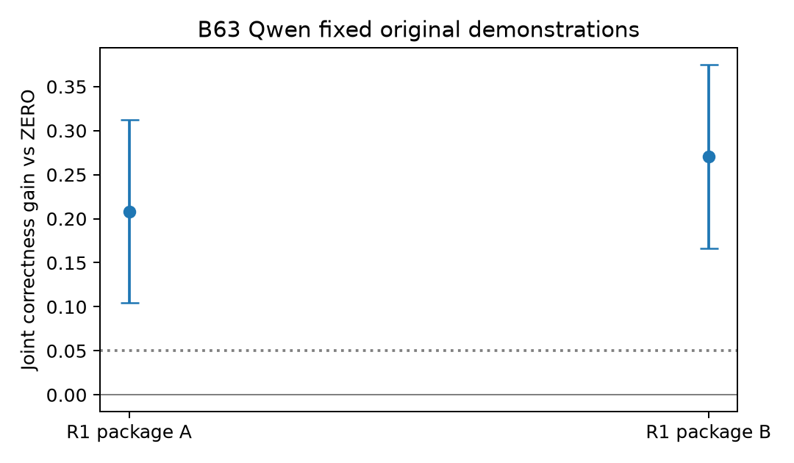
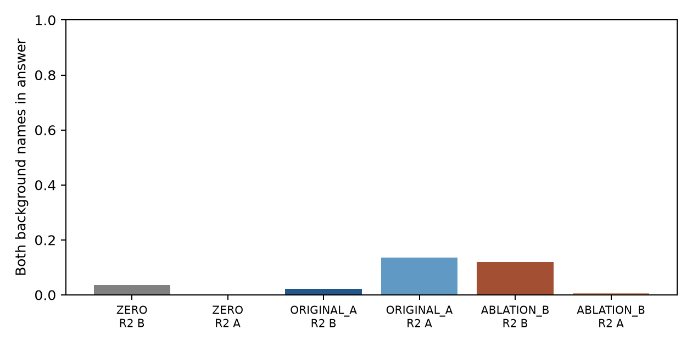

# B63 results and B64 design-only review

14 September 2026. **B63 is complete and Main-audited. B64 has not been dispatched or run.** Independent human gold remains zero. No new probe intervention is authorized by this package.

## What B63 tested

Two author-written expression frames A/B were crossed between target R1 and irrelevant R2. R1 and R2 event facts were held constant across demonstration conditions. ZERO, the frozen original A-frame four-example package, and a fixed B-frame ablation were tested with AU/UA field orders, 把/被 targets, same-fact 把/被 backgrounds, and no-background role-swap controls. There are 24 author groups, 4,608 new responses and 48 old bridges: 4,656 outputs total, 78,721 autoregressive forwards. Bridges reproduce saved text and tokens. Layer count, prompt count, and forward count are not independent sample sizes.

| Result | ZERO | ORIGINAL_A | ABLATION_B |
|---|---:|---:|---:|
| Qwen complete correctness, all new items per condition | 739/768 | 768/768 | 768/768 |
| Apertus complete correctness | 639/768 | 608/768 | 598/768 |
| Apertus no-background correctness | 359/384 | 345/384 | 353/384 |
| Apertus rescue / new harm vs ZERO | — | 56 / 87 | 36 / 75, plus 2 unresolved |

Qwen's primary same-fact joint-correctness P rises from 38/48 to 48/48 under target frame A and from 35/48 to 48/48 under B: +20.83 and +27.08 percentage points, with positive 24-group bootstrap and leave-one results. Both demonstration conditions rescue the **same 29 items**, not 58 independent successes. NONE is already 384/384 under each Qwen condition. This supports limited transfer across two author expression packages, not natural-text generalization or guaranteed harmlessness. Correctness, unchanged mapping, and both-sides-correct P remain separate metrics.

Apertus's preregistered frame-match interaction is **11.46 pp**, group-bootstrap 95% interval **[5.73, 17.71]**, minimum leave-one estimate 10.05 pp. Under ORIGINAL_A, complete background-name outputs are 4/192 when R1 uses A and 26/192 when it uses B. Under ABLATION_B, these become 23/192 and 1/192. Matching-related record selection is supported at the package level. But overall and NONE performance also fall: the data do **not** support “demonstrations only harm selection while generally fixing role binding.” Error categories do not identify sequential internal modules.

## Evidence and limits

- [Main interpretation and concrete raw-answer cases (Chinese)](B63/MAIN-ANALYSIS.zh-CN.md)
- [Summary with all group contributions and leave-one values](B63/SUMMARY.json), [paired endpoints](B63/ALL-PAIRS.json), [all transitions](B63/TRANSITIONS.json)
- [Actual references and messages](B63/REFERENCES.jsonl.gz), [all raw outputs, tokens, and rendered prefixes](B63/RAW-OUTPUTS.jsonl.gz), [frozen scores](B63/SCORES.jsonl.gz)
- [B63 design](B63/MAIN-DESIGN.zh-CN.md), [during-run analysis amendment](B63/AMENDMENT-04-BACKGROUND-BOUNDS.zh-CN.md), [original v1 summary](B63/SUMMARY-V1.json), [two changed bounds](B63/BACKGROUND-BOUND-CHANGES.json)

Two Apertus unknown-name outputs remain content-U. A known target field rules out a complete background mapping, tightening E's upper bound without repairing the answer. Amendment 04 was frozen during generation before new-answer inspection; it is not described as the original preregistration. v1 and amended results are retained, and decision labels do not change. Shared templates/predicates, lengths, punctuation, author validity, and exposed development materials limit inference. AI and mechanical acceptance are not independent human validation.

## B64: one proposed discriminating experiment, not running

[B64 design (Chinese)](B64/MAIN-DESIGN.zh-CN.md) asks whether **which frame is associated with the queried record in demonstrations** changes record selection, while both frames occur equally often. Four valid two-record demonstrations contain the same events, order, words, and punctuation in both packages. PAIR_A associates frame A with queried R1; PAIR_B swaps record labels and corresponding correct answers to associate B with R1. Query position is balanced within construction. ZERO remains the exact B63 baseline.

The planned cap is 3,120 calls: all 24 exposed B63 groups, a fixed eight-group NONE control, two existing models, and 48 bridges. Apertus is primary for the prespecified association interaction; Qwen is the boundary and harm check. All examples and [proposed actual inputs](B64/PROPOSED-INPUTS.jsonl.gz) are prepared, including [eight review IDs](B64/REVIEW-SAMPLE.json). Character/byte counts match; native token lengths have **not** been checked. This tests local demonstration association, not training-corpus frequency. These new two-record demonstrations are not a minimal repair of B60. No GPU, smoke run, or formal B64 call is authorized until explicit release.

## Reproduce and review

Run `python verify_public.py` with NumPy installed. This verifies every public file hash, recomputes all B63 scores, both original and revised primary summaries, pair/group statistics and transitions from the public messages/raw outputs, and checks B64's zero-call state and input counts. It does not rerun models or establish material validity. Original scripts are retained; use the verifier rather than invoking their private-layout command-line entry points. Step journals, hidden arrays, and personal Office originals are not included; [Office hashes](OFFICE-COMMITMENTS.json) and [local archive commitments](LOCAL-ARCHIVE-COMMITMENTS.json) are supplied. This named public repository is not an anonymous reviewing supplement.
