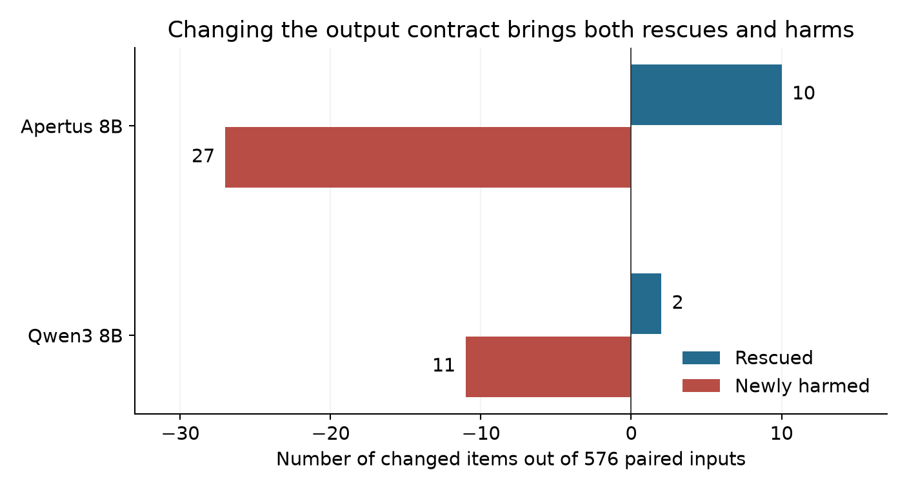
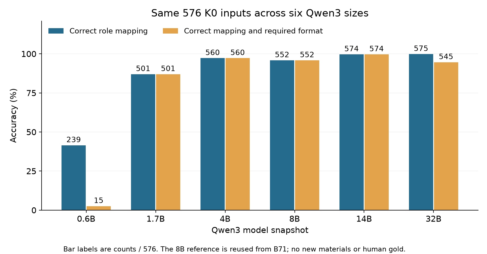
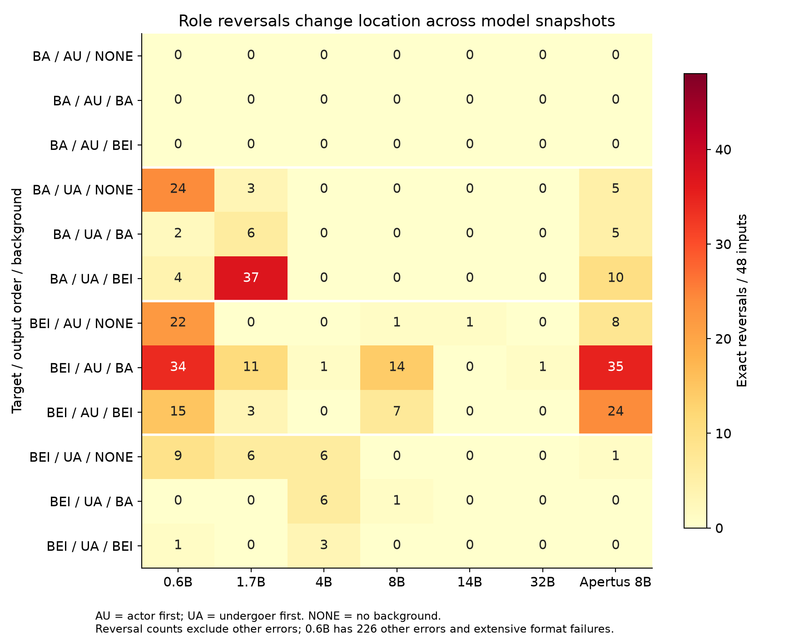

# B71–B72 evidence review

**Scope:** B71's developmental baseline replication, B72's output-contract test and Qwen3 size comparison, plus the bounded candidate-score diagnosis. Independent human material review is **0**. This is a research evidence package, not an independently validated benchmark or an anonymous submission supplement.

The behavioral results strengthen a **conditional** finding while narrowing its scope: irrelevant background increases role reversals in the specified Qwen3-8B condition, but that failure location is not shared uniformly across Qwen3 sizes. The larger snapshots approach ceiling on these inputs. A participant-compatible output contract failed its operational gate; the semantic/animacy arm was **not run**.

**Snapshot scope:** the complete natural-generation stages are included below. P2a is prepared and authorized for a bounded first check but has **0 candidate and 0 diagnostic forwards**, because the laboratory GPUs currently do not meet the frozen single-card memory requirement. P1 remains unrun after the failed gate. This snapshot does not claim all planned B72 stages have finished.

Read [the Chinese interpretation](INTERPRETATION.zh-CN.md), [all numeric summaries](SUMMARY.json), [the full condition table](STRATA.json), and [reproducibility instructions](#reproduce-the-offline-audit). Historical work through B70 is preserved in the [B63–B70 review at af0b444](https://github.com/AlmightyLLY/doppelganger-jc-reproduction/tree/af0b444ad517887e84f8a78909ad3be3146a2f44/papers/doppelganger-jc/experiments/EXP-20260915-B63-B70-REVIEW).

## 1. What was measured

Given two independent records, the instruction asks for **R1 only**. Each answer maps `actor` and `undergoer` to the two participants. BA is a 把 construction, BEI a 被 construction. AU emits actor first; UA emits undergoer first. R2 is absent (NONE), or expresses an unrelated event in BA/BEI wording. Changing BA to BEI preserves the background's participant-role facts, while changing mention order, marker and information organization together; it is not an isolated manipulation of abstract syntax.

There are 24 author-created material clusters, two real role directions, two target constructions, two field orders and three background conditions: **576 positions per model and contract**. Positions within a cluster are dependent. Main statistics resample clusters, not 576 independent semantic items. B71/B72 share the same baseline material; running new sizes is not a new-material replication.

Three measures remain separate:

- **C:** exact correct role mapping, with an interpretable mapping extracted by the frozen whole-response parser.
- **R:** exact reversal of the target pair. Other errors, including name truncation and background answers, are not forced into R.
- **Format:** bare JSON with the requested keys and field order. A correct mapping inside a code fence can satisfy C while failing format.

The main background statistic is **B = R(BEI/AU, background average) − R(BEI/AU, NONE)**. It measures a change in reversal rate, not total accuracy, confidence, or a hidden mechanism. The [group contributions and leave-one/interval results](BACKGROUND-EFFECTS.json) use each batch's frozen bootstrap seed.

## 2. B71 replicated the specified developmental prediction

| 8B system | Role-correct / 576 | BEI/AU NONE R / 48 | BA background R / 48 | BEI background R / 48 | B, percentage points |
|---|---:|---:|---:|---:|---:|
| Qwen3 | 552 | 1 | 14 | 7 | +19.79 [10.42, 29.17] |
| Apertus | 488 | 8 | 35 | 24 | +44.79 [32.29, 57.29] |

Qwen passed the preregistered **developmental** support criteria. Of its 24 incorrect outputs, 23 occurred in BEI/AU. Apertus had a larger background difference but only 40/48 correct in the BEI/AU NONE capability control, below its 90% gate. It therefore did **not** pass the same full support criterion. A failed capability gate is not evidence that its observed background effect is zero.

Example: R1 is unchanged: `在院子，李泽远被孙嘉宁推倒了。` The correct actor is 孙嘉宁. Qwen answers correctly with no R2, reverses the roles after the independent background `石俊鹏把程嘉月送走了`, and recovers when R2 is rewritten with 被 to express the same event. See [the paired concrete cases](CONCRETE-CASES.json).

The B71 history matters: an earlier participant-contract bridge failed; the batch returned to the original person contract before the new scientific baseline outputs. That sequence and subsequent technical revisions are retained. This was not a human-validated confirmation trial with a completed personal prediction form.

## 3. B72's new contract failed its gate

K0 refers to persons and full personal names. K1 changes the fixed wording to participants and full names that may denote people or objects. Facts, target/background arrangement and the requested field order otherwise remain fixed. The exact contracts are visible in every released input.

| System | K0 C / 576 | K1 C / 576 | Rescue | New harm | Net C change |
|---|---:|---:|---:|---:|---:|
| Qwen3-8B | 552 | 543 | 2 | 11 | −1.56 pp |
| Apertus-8B | 488 | 471 | 10 | 27 | −2.95 pp |



Qwen's BEI/UA + BA-background cell changed from **47/48 to 45/48**, below the predeclared minimum of **46/48**. The other operational checks passed. This is two new errors in that cell, despite missing the threshold by one item. The overall Qwen paired C-change interval includes zero [−3.65, +0.17 pp]; the point gate is not a statistical equivalence test or proof of a large interface effect. Apertus's corresponding overall interval is [−5.21, −0.69 pp]. See [all 1,152 K0/K1 transitions](K0-K1-TRANSITIONS.json) and [the frozen gate outcome](B72/P0-GATE.json).

All K1 outputs satisfied the requested format. Qwen's five other-error outputs truncate the name 苗清和 to 苗清; four are new harms. They remain in the original scoring and are not silently removed to make the gate pass.

**Consequent decision:** no new AA, object, or social-role semantic arm was run. No K2 wording search or gate relaxation was performed. The semantic hypothesis is untested, not falsified. The original K0 size comparison is independent of this gate.

## 4. Scale changes both error rate and error location

All rows below use **K0**, including the reused B71 8B reference. The K1 543/576 score is not used as the 8B scale point.

| Qwen3 snapshot | C / 576 | Exact R | Other errors | Format compliant | C and format |
|---|---:|---:|---:|---:|---:|
| 0.6B | 239 | 111 | 226 | 37 | 15 |
| 1.7B | 501 | 66 | 9 | 576 | 501 |
| 4B | 560 | 16 | 0 | 576 | 560 |
| 8B (B71 reused) | 552 | 23 | 1 | 576 | 552 |
| 14B | 574 | 1 | 1 | 576 | 574 |
| 32B | 575 | 1 | 0 | 546 | 545 |



14B and 32B are near ceiling for role correctness **on these materials**. This constrains any claim that the same large error is persistent at those sizes; it does not prove universal reliability. There is no established monotonic scaling law: 4B outperforms 8B overall here. The 30 role-correct 32B answers with Markdown fences must not be counted as either exact reversals or format-compliant answers.



The condition table adds a particularly important boundary:

- **4B:** 15 of 16 reversals occur in **BEI/UA**, not BEI/AU. BEI/AU has only one reversal across all backgrounds.
- **8B:** 23 of 24 noncorrect outputs occur in **BEI/AU**. It has no BA/UA reversal.
- **1.7B:** BA/UA with BEI background has 37/48 reversals and only 11/48 correct; that snapshot does not share 8B's selective location.
- **0.6B:** extensive format and other-answer failures prevent interpreting low reversal counts in some cells as competence.

These are descriptive differences on frozen inputs, not a newly confirmed explanatory rule. The observed target/output interaction must be tested as a model-dependent pattern rather than promoted to a universal passive or position-copy mechanism. Hardware and model training are not separately isolated causes in this size comparison.

## 5. Candidate-score diagnosis

The bounded P2a diagnosis uses only the 1,152 completed K1 inputs. It scores the frozen full correct and reversed JSON strings (2,304 candidate sequences) and at most 32 fixed actual-prefix replays. It adds no new natural inputs and no semantic-arm results. At this snapshot: **0 candidate sequences scored, 0 diagnostic forwards**. These are pending results, not zero effects. The frozen input/Office preparations exist privately, and later execution will be appended as a new dated snapshot.

`m = log p(correct content) − log p(reversed content)` excludes prompt and terminal tokens; the terminal-inclusive value is separate. It is a **gold-conditioned diagnostic**, not a label-free item-level predictor. Greedy decoding need not choose the most probable complete sequence. A changed margin on a correct answer is not a behavioral error, proof of latent confusion, or evidence that the model knew the answer and refused to use it.

## 6. Evidence and limits

- [B71 raw outputs](B71/RAW-OUTPUTS.jsonl.gz), [reference/input records](B71/REFERENCES.jsonl.gz), [recorded natural token steps](B71/NATURAL-STEPS.jsonl.gz).
- [B72 raw outputs](B72/RAW-OUTPUTS.jsonl.gz), [reference/input records](B72/REFERENCES.jsonl.gz), [recorded natural token steps](B72/NATURAL-STEPS.jsonl.gz).
- [272 technical outputs](TECHNICAL-OUTPUTS.jsonl.gz): B71's 224 and B72's 48 bridge executions, separate from the **5,184 scientific natural outputs**. The cloud Apertus bridge repeats 16 fixed historical checks intentionally; those repeats are not new scientific samples.
- [Model configuration](MODEL-CONFIG.json), [source commitments](SOURCE-COMMITMENTS.json), and the [final Office/archive commitments](OFFICE-ARCHIVE-COMMITMENTS.json) preserve provenance. Private editable Office originals remain local; the package does not expose unrun semantic materials or credentials.

Human material review is still absent. AI material checks, Main's raw-data audit, frozen files and checksum verification do not substitute for it. Historical error exposure, shared predicates/templates, name-boundary ambiguities and the selected model snapshots limit generalization. Successful stage gates do not establish a causal mechanism. Failed gates and newly harmed items are retained.

No result here proves a universal prompt repair, an animacy mechanism, a cross-language explanation or a particular conference outcome. Near-ceiling performance narrows the tested failure's scope; it does not retrospectively erase B71's conditional observation. If independent material review or future preregistered tests invalidate the current pattern, the claim must be revised accordingly.

## Reproduce the offline audit

With Python and NumPy installed, run from this directory:

```bash
python verify_public.py
python audit_public.py
python audit_tokens.py
```

The audits verify committed hashes, re-score all natural answers, derive target roles from marker/name order, reproduce all condition counts, cluster intervals, leave-one values, contract transitions and the P0 gate. Token audit checks the saved actual prefixes, argmax selections, finite values and EOS history. This is an offline evidence audit, **not a rerun of model inference** or an independent human judgment. Matplotlib is only needed to regenerate the figures.

## Prompts for external review

[Claude review prompt (English)](CLAUDE-PROMPT.en.md) · [Pro review prompt (Chinese)](PRO-PROMPT.zh-CN.md). These prompts ask reviewers to distinguish verified facts, competing explanations and unrun stages.
